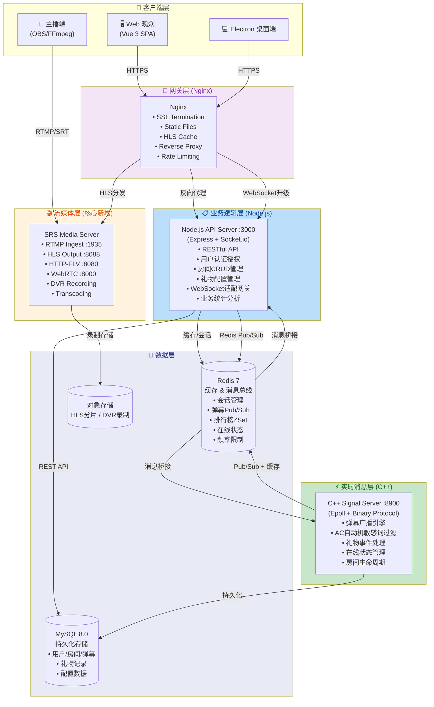
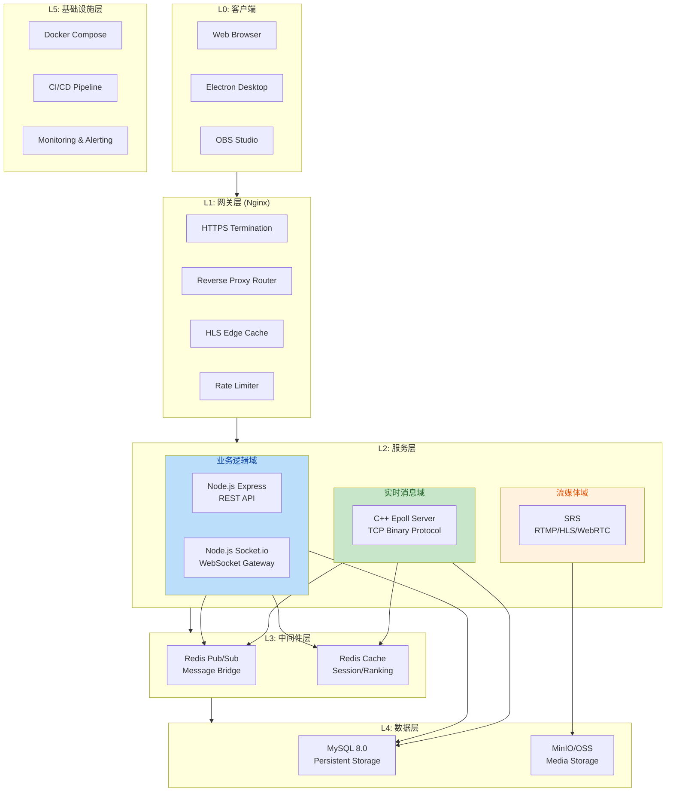
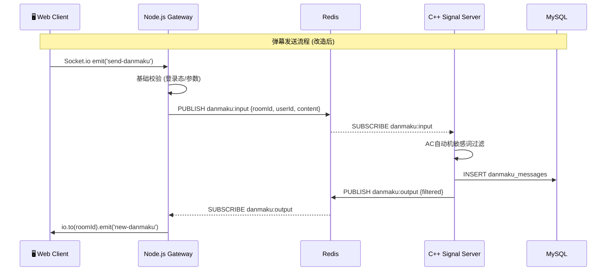
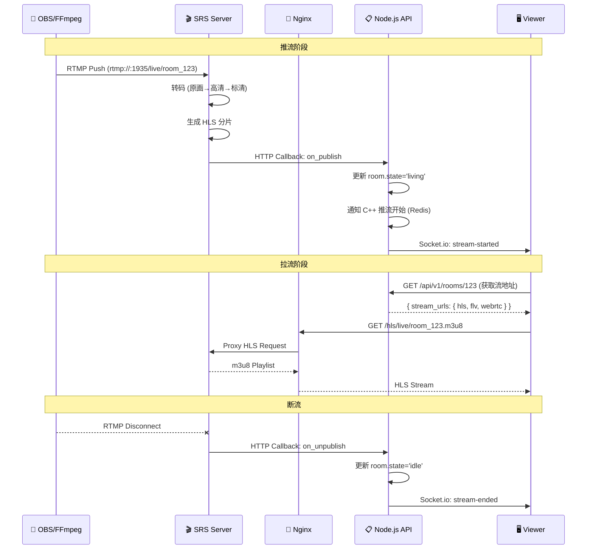
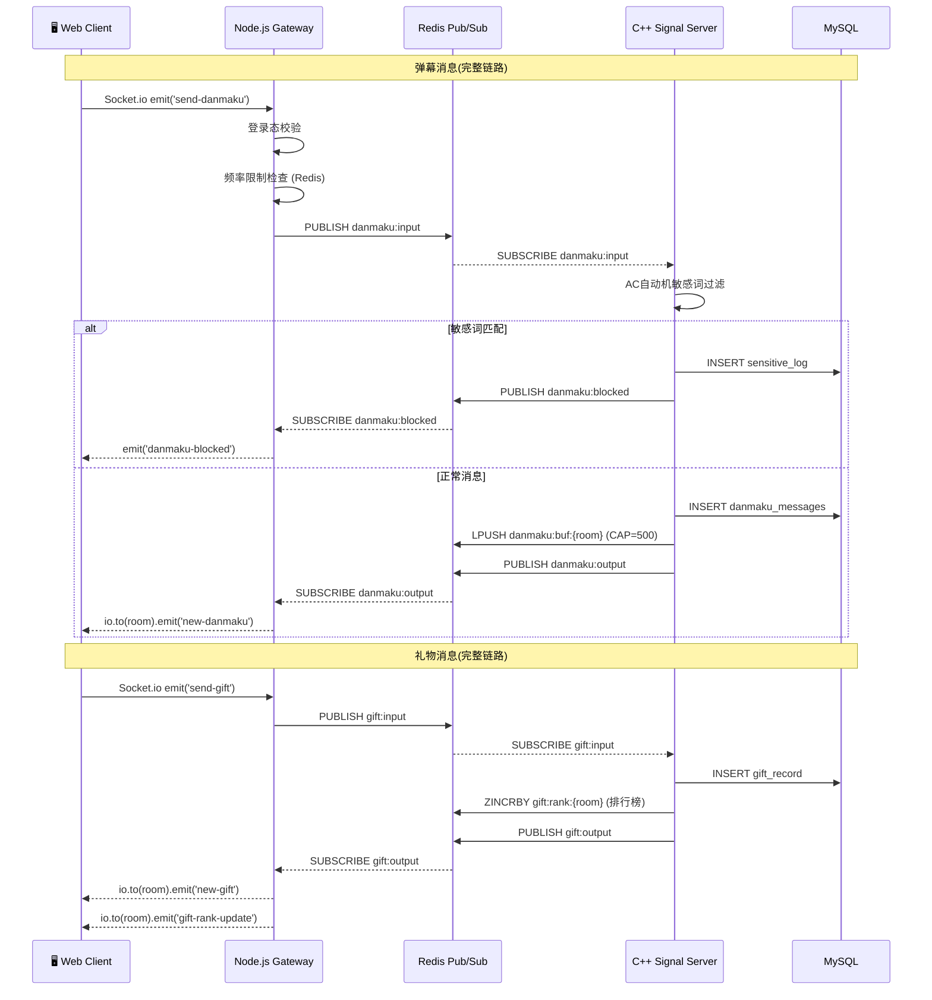
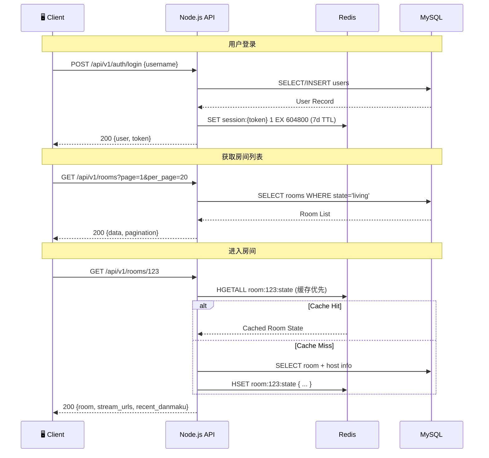
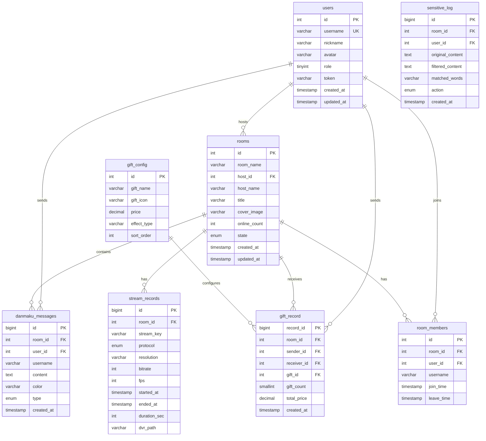
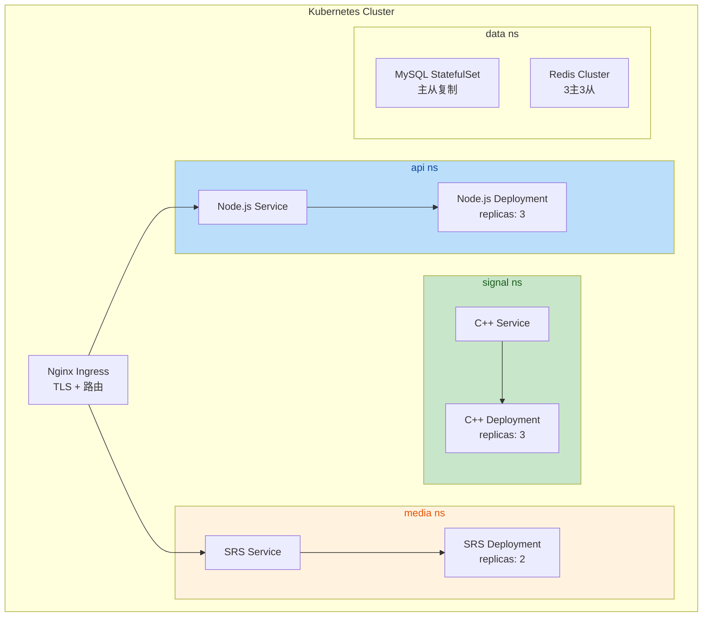
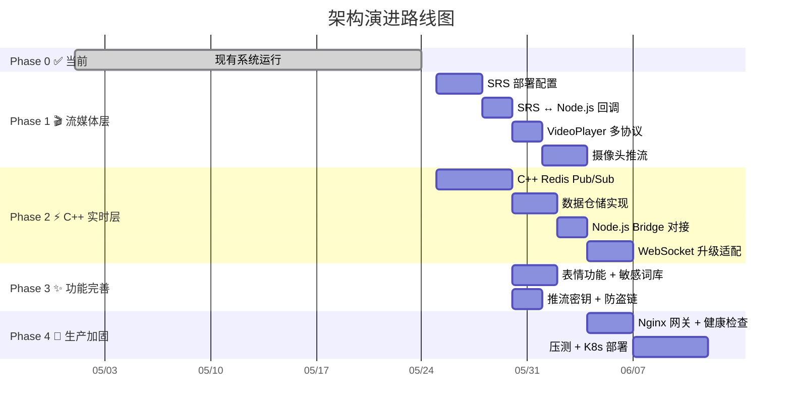

# AI 直播平台 — 完整架构设计文档

---

**文档版本:** v2.0  
**最后更新:** 2026-05-24  
**设计角色:** 资深大厂架构师 (Principal Architect)  
**设计方法论:** Domain-Driven Design + C4 Model + API-First  
**API 规范:** OpenAPI 3.1 + RESTful Patterns  
**适用范围:** 全系统（已实现 + 待实现）

---

## 目录

1. [架构总览](#1-架构总览)
2. [核心设计原则](#2-核心设计原则)
3. [系统分层架构](#3-系统分层架构)
4. [组件详细设计](#4-组件详细设计)
   - [4.1 流媒体服务器层 (SRS)](#41-流媒体服务器层-srs)
   - [4.2 C++ 实时消息服务器](#42-c-实时消息服务器)
  - [4.3 Node.js API 网关服务器](#43-nodejs-api-网关服务器)
   - [4.4 Vue 3 前端应用](#44-vue-3-前端应用)
   - [4.5 Nginx 网关层](#45-nginx-网关层)
   - [4.6 数据层](#46-数据层)
5. [通信架构](#5-通信架构)
   - [5.1 协议分层](#51-协议分层)
   - [5.2 视频流传输链路](#52-视频流传输链路)
   - [5.3 实时消息链路](#53-实时消息链路)
   - [5.4 业务请求链路](#54-业务请求链路)
6. [REST API 接口设计 (OpenAPI 3.1)](#6-rest-api-接口设计)
   - [6.1 资源模型](#61-资源模型)
   - [6.2 认证与授权](#62-认证与授权)
   - [6.3 通用规范](#63-通用规范)
   - [6.4 端点目录](#64-端点目录)
   - [6.5 核心 Schema 定义](#65-核心-schema-定义)
   - [6.6 错误码规范](#66-错误码规范)
7. [C++ 二进制协议设计](#7-c-二进制协议设计)
8. [数据库设计](#8-数据库设计)
9. [安全架构](#9-安全架构)
10. [性能架构](#10-性能架构)
11. [部署架构](#11-部署架构)
12. [实施路线图](#12-实施路线图)

---

## 1. 架构总览

### 1.1 系统定位

本项目是一个**生产级 AI 实时互动直播平台**，需要同时承载：
- **视频流分发**：主播推流 → 服务端转码/录制 → 万人级观众拉流
- **实时消息处理**：弹幕广播、礼物通知、在线状态同步（毫秒级延迟）
- **业务逻辑处理**：用户管理、房间 CRUD、礼物配置、数据统计

### 1.2 核心架构图



### 1.3 组件职责矩阵

| 组件 | 技术栈 | 端口 | 核心职责 | 当前状态 |
|------|--------|------|----------|----------|
| **SRS Media Server** | C++ (SRS) | 1935/8080/8088/8000/1985/10080 | 流媒体接入与分发 | ❌ 待部署 |
| **C++ Signal Server** | C++17 + Epoll | 8900 | 实时消息处理 | ⚠️ 代码完成，未启动 |
| **Node.js API Server** | Express + Socket.io | 3000 | REST API + WS 网关 | ✅ 已运行 |
| **Vue 3 Frontend** | Vue 3 + Vite | 5173 | 用户界面 | ✅ 已运行 |
| **Nginx Gateway** | Nginx | 443/80 | 入口网关 | ❌ 待部署 |
| **MySQL** | MySQL 8.0 | 3308→3306 | 持久化存储 | ✅ 已运行 |
| **Redis** | Redis 7 | 6379 | 缓存/消息总线 | ✅ 已运行 |

---

## 2. 核心设计原则

### 2.1 分层解耦原则

```
┌─────────────────────────────────────────────┐
│  表现层 (Presentation)                       │
│  Vue 3 SPA + Electron → 用户交互            │
├─────────────────────────────────────────────┤
│  网关层 (Gateway)                           │
│  Nginx → 接入、路由、安全                    │
├──────────────┬──────────────┬───────────────┤
│  视频域       │  实时消息域    │  业务域       │
│  SRS         │  C++ Server   │  Node.js API  │
│  独立处理      │  独立处理      │  独立处理      │
│  流媒体        │  弹幕/礼物     │  CRUD/认证    │
├──────────────┴──────────────┴───────────────┤
│  数据层 (Data)                               │
│  MySQL + Redis + 对象存储                    │
└─────────────────────────────────────────────┘
```

**核心原则**：视频流、实时消息、业务逻辑是三种完全不同性质的负载，必须分而治之：
- **视频流**：高带宽、长连接、UDP/TCP 混合，需要专用流媒体服务器
- **实时消息**：高并发、低延迟、小报文，需要 C++ Epoll 事件驱动
- **业务逻辑**：复杂规则、频繁变更，需要 Node.js/脚本语言的灵活性

### 2.2 消息总线模式

C++ 实时消息服务器和 Node.js API 服务器之间**不直接通信**，而是通过 **Redis Pub/Sub** 作为消息总线进行解耦：

```
Web Client → Socket.io → Node.js → Redis Pub/Sub → C++ Server → Redis Pub/Sub → Node.js → Web Client
```

好处：
- 两个服务可以独立部署、独立扩缩容
- 服务故障不互相影响（Redis 作为缓冲）
- 新增消费者无需修改生产者

### 2.3 API-First 设计

所有接口先定义 OpenAPI 3.1 契约，前后端基于契约并行开发。详细规范见 [第 6 节](#6-rest-api-接口设计)。

---

## 3. 系统分层架构



---

## 4. 组件详细设计

### 4.1 流媒体服务器层 (SRS)

#### 4.1.1 选型分析

| 方案 | 优势 | 劣势 | 决策 |
|------|------|------|------|
| **SRS** | C++ 实现性能极高；RTMP/HLS/WebRTC 多协议；活跃社区；国产开源 | 需额外部署 | ✅ **推荐** |
| nginx-rtmp | 与 Nginx 集成；配置简单 | 项目已停止维护；无 WebRTC | ❌ |
| LiveGo | Go 实现，部署简单 | 功能有限，社区小 | ❌ |
| MediaSoup | WebRTC SFU 专精 | 无 RTMP/HLS | ❌ 备选 |

#### 4.1.2 SRS 部署配置

```
SRS 服务端口规划:
┌──────────┬─────────┬────────────────────────────┐
│  端口    │ 协议     │ 用途                       │
├──────────┼─────────┼────────────────────────────┤
│  1935    │ RTMP    │ 主播推流入口 (OBS/FFmpeg)   │
│  8080    │ HTTP-FLV│ 低延迟 HTTP 拉流            │
│  8088    │ HLS     │ m3u8 + ts 分片分发          │
│  8000    │ WebRTC  │ 超低延迟 WebRTC (UDP)       │
│  1985    │ HTTP API│ SRS 管理接口 (回调/统计)     │
│  10080   │ SRT     │ 可靠的互联网推流(可选)        │
└──────────┴─────────┴────────────────────────────┘
```

**SRS 核心配置** (`srs.conf`):

```nginx
listen              1935;       # RTMP 推流
max_connections     50000;      # 最大连接数
daemon              off;

# HLS 配置
hls {
    enabled         on;
    hls_fragment    3;          # 3秒一个分片
    hls_window      15;         # 保留15秒窗口
    hls_path        ./objs/nginx/html/hls;
    hls_m3u8_file   [app]/[stream].m3u8;
    hls_ts_file     [app]/[stream]-[seq].ts;
}

# HTTP-FLV 配置 (低延迟)
http_server {
    enabled         on;
    listen          8080;
    dir             ./objs/nginx/html;
}

# HTTP API 配置
http_api {
    enabled         on;
    listen          1985;
    crossdomain     on;
}

# WebRTC 配置 (超低延迟)
rtc_server {
    enabled         on;
    listen          8000;
    candidate       $CANDIDATE;  # 公网 IP
}

# DVR 录制
dvr {
    enabled         on;
    dvr_path        ./objs/nginx/html/dvr/[app]/[stream]/[2006]/[01]/[02]/[15].[04].[05].[999].flv;
    dvr_plan        session;
}

# 转码 (使用 FFmpeg)
# 注意：vcodec/vbitrate/vfps/vwidth/vheight 直接放在 engine 块下，不能嵌套在 vfilter 内
# vfilter 用于 ffmpeg 滤镜图（如叠加水印），视频编码参数不属于 vfilter
transcode {
    enabled     on;
    ffmpeg      ./objs/ffmpeg/bin/ffmpeg;
    engine sd {
        enabled         on;
        vcodec          libx264;
        vbitrate        800;
        vfps            25;
        vwidth          854;
        vheight         480;
        acodec          aac;
        abitrate        96;
        asample_rate    44100;
        achannels       1;
    }
}
```

#### 4.1.3 推流工作流

```
1. 主播端 (OBS/FFmpeg):
   ffmpeg -re -i input.mp4 -c:v libx264 -preset veryfast \
          -b:v 2500k -c:a aac -b:a 128k \
          -f flv rtmp://live.example.com:1935/live/room_123

2. SRS 接收 RTMP 流:
   - 转码为多码率 (原画/高清/标清)
   - 生成 HLS 分片 (.m3u8 + .ts)
   - 可选 DVR 录制
   - 通过 HTTP 回调通知业务层

3. 观众拉流:
  - 默认: HLS (兼容性最好)  → https://live.example.com/hls/live/room_123.m3u8
   - 低延迟: HTTP-FLV        → https://live.example.com/live/room_123.flv (经Nginx代理)
  - 超低延迟: WebRTC        → webrtc://live.example.com/live/room_123

4. SRS → Node.js 回调集成:
   POST http://node-api:3000/api/v1/stream/callback
   {
     "action": "on_publish",      // 推流开始
     "stream": "room_123",        // 注意：此处仅为 stream 名称（不含 app 前缀），app 是独立字段
     "client_id": "xxx",
     "app": "live"
   }

   // ⚠️ 实施注意：SRS 回调中 stream 是字符串如 "room_123"，不是整数 roomId。
   // Node.js 需要从 stream 字符串中提取数字 ID：
   //   const roomId = parseInt(stream.replace('room_', ''), 10);
   // 建议推流时统一使用 "room_{roomId}" 命名规范，确保解析一致。

   POST http://node-api:3000/api/v1/stream/callback
   {
     "action": "on_unpublish",    // 推流结束
     "stream": "room_123"
   }
```

#### 4.1.4 前端播放器集成

VideoPlayer.vue 需要改造为支持多协议自适应选择：

```
协议选择优先级:
1. WebRTC (延迟 < 1s)     → 现代浏览器 + 低延迟要求
2. HTTP-FLV (延迟 1-3s)   → 不支持 WebRTC 时的回退
3. HLS (延迟 5-15s)       → 全兼容保底方案
```

---

### 4.2 C++ 实时消息服务器

#### 4.2.1 定位与职责

C++ Signal Server 是整个平台的**实时消息处理核心**，承担全部高吞吐、低延迟的消息处理：

| 职责 | 说明 | 性能目标 |
|------|------|----------|
| 弹幕接收与广播 | 接收弹幕 → AC 过滤 → 广播给房间内所有人 | 100,000 QPS |
| 礼物事件处理 | 接收礼物 → 持久化 → 广播通知 → 排行榜更新 | 10,000 QPS |
| 在线状态管理 | 进/离房 → Redis Set 维护 → 在线数同步 | 实时 |
| 敏感词过滤 | AC 自动机 O(n) 匹配 → 分级处理 | 纳秒级 |
| 心跳管理 | 时间轮定时器 → 断线检测 | 10s 超时 |

#### 4.2.2 改造方案：从独立 TCP 到 Redis 总线集成

当前 C++ 服务器 (backend-server) 已经完成：
- ✅ Epoll TCP 服务器框架
- ✅ 自定义二进制协议 (48字节头 + Protobuf 体)
- ✅ AC 自动机敏感词过滤
- ✅ MySQL/Redis 连接池
- ✅ 线程池 + 时间轮
- ❌ 数据仓储接口未实现
- ❌ 未与 Node.js 侧集成

**改造要点**: 为 C++ 服务器增加 Redis Pub/Sub 订阅能力，使其可以接收来自 Node.js 网关转发过来的消息，处理后将结果发布回 Redis。



#### 4.2.3 Redis Pub/Sub 频道设计

```
┌─────────────────────────────────────────────────────────┐
│ 频道命名规范: {domain}:{action}:{scope}                   │
├─────────────────────────────────────────────────────────┤
│ danmaku:input          → 弹幕输入 (N→C++)                │
│ danmaku:output         → 弹幕输出 (C++→N)                │
│ danmaku:blocked        → 被过滤的弹幕通知                  │
│ gift:input             → 礼物输入 (N→C++)                │
│ gift:output            → 礼物输出 (C++→N)                │
│ room:join              → 进入房间 (N→C++)                │
│ room:leave             → 离开房间 (N→C++)                │
│ room:state_sync        → 房间状态同步 (C++→N)            │
│ presence:online_count  → 在线人数变更 (C++→N)            │
│ stream:status          → 推流状态变更 (N→C++)            │
└─────────────────────────────────────────────────────────┘
```

#### 4.2.4 C++ 消息处理流水线

```
┌──────────────────────────────────────────────────────────────┐
│                  C++ Message Pipeline                         │
│                                                              │
│  Redis Input ──→ [解码] ──→ [鉴权] ──→ [AC过滤]              │
│                                                │              │
│                    ┌───────────────────────────┤              │
│                    ▼                           ▼              │
│              [屏蔽消息]                   [正常消息]           │
│                    │                           │              │
│                    ▼                           ▼              │
│            PUB blocked              ┌──→ [持久化 MySQL]       │
│                                    │                         │
│                                    ├──→ [统计累加 Redis]      │
│                                    │                         │
│                                    └──→ [广播 PUB output]     │
│                                                              │
└──────────────────────────────────────────────────────────────┘
```

#### 4.2.5 启动与编译

```bash
# 使用 Docker Compose 中的 C++ 开发容器
cd backend-server
mkdir -p build && cd build
cmake .. -DCMAKE_BUILD_TYPE=Release
make -j$(nproc)

# 启动（注意：CMakeLists.txt 中 add_executable 目标名为 chatroom-server，生成的可执行文件名即 chatroom-server）
./chatroom-server --config ../config/app.json
```

`config/app.json` 更新为支持 Redis Pub/Sub：
```json
{
  "server": {
    "host": "0.0.0.0",
    "port": 8900,
    "worker_threads": 8,
    "max_connections": 50000
  },
  "redis": {
    "host": "redis",
    "port": 6379,
    "pool_size": 16,
    "pubsub_channels": [
      "danmaku:input",
      "gift:input",
      "room:join",
      "room:leave",
      "stream:status"
    ]
  },
  "mysql": {
    "host": "mysql",
    "port": 3306,
    "database": "chatroom_db",
    "pool_size": 32
  },
  "filter": {
    "dict_path": "../config/sensitive_words.txt",
    "hot_reload_interval_sec": 300,
    "default_action": "mask"
  }
}
```

---

### 4.3 Node.js API 网关服务器

#### 4.3.1 角色瘦身

当前 api-server 承担了太多职责。架构改造后，Node.js 应瘦身为**轻量 API 网关 + WebSocket 适配层**：

**保留职责**（Node.js 擅长的）:
- RESTful API 端点（用户/房间 CRUD、礼物配置）
- 用户认证与 Token 管理（Session Token + Redis Session）
- WebSocket 接入适配（Socket.io，连接 Web 客户端）
- 业务规则校验（余额检查、权限验证）
- API 入口级限流与防刷（粗粒度保护）
- Redis Pub/Sub 转发（将 WS 消息桥接到 C++ 处理链）

**移除职责**（迁移到 C++）:
- 弹幕持久化写入 → C++ 直接写 MySQL
- 弹幕广播分发 → C++ 通过 Redis Pub/Sub 广播
- 礼物排行榜更新 → C++ 直接操作 Redis ZSet
- 敏感词过滤 → C++ AC 自动机
- 在线人数管理 → C++ 基于 Redis Set
- 弹幕/礼物等实时消息频率限制 → C++ 基于 Token Bucket

#### 4.3.2 改造后的 Node.js 代码结构

```
api-server/
├── src/
│   ├── server.js              # 入口：Express + Socket.io (保留，改造)
│   ├── app.js                 # Express 应用配置 [新增: 中间件链]
│   ├── middleware/             # [新增目录]
│   │   ├── auth.js            # Token 认证中间件（Redis Session）[新增]
│   │   ├── validate.js        # 请求参数校验 (Joi/Zod) [新增]
│   │   ├── rateLimit.js       # API 频率限制 [新增]
│   │   └── errorHandler.js    # 全局错误处理 (RFC 7807) [新增]
│   ├── routes/
│   │   ├── index.js           # 路由汇总 [新增]
│   │   ├── auth.js            # 认证路由 [新增，拆分自 api.js]
│   │   ├── rooms.js           # 房间路由 [新增，拆分自 api.js]
│   │   ├── gifts.js           # 礼物配置路由 [新增，拆分自 api.js]
│   │   ├── users.js           # 用户路由 [新增]
│   │   └── stream.js          # 推流回调路由 [新增]
│   ├── services/
│   │   ├── database.js        # MySQL 连接池 (保留)
│   │   ├── userService.js     # 用户服务 [重命名自 user.js，改造]
│   │   ├── roomService.js     # 房间服务 [重命名自 room.js，瘦身]
│   │   ├── giftConfigService.js # 礼物配置服务 [重命名自 gift.js，保留]
│   │   ├── redisBridge.js     # Redis Pub/Sub 桥接 [新增核心]
│   │   └── wsGateway.js       # WebSocket 网关适配 [重命名自 socket.js，改造]
│   └── validators/            # [新增目录]
│       ├── auth.validator.js  # 认证请求校验 [新增]
│       ├── room.validator.js  # 房间请求校验 [新增]
│       └── gift.validator.js  # 礼物请求校验 [新增]
└── config/
    ├── database.js            # (保留)
    └── redis.js               # Redis 连接配置 [新增]
```

#### 4.3.3 Redis Bridge 核心逻辑

```javascript
// api-server/src/services/redisBridge.js
// Node.js ↔ C++ 的消息桥梁，基于 Redis Pub/Sub
// 初始化时需要传入 Socket.io Server 实例用于广播消息

class RedisBridge {
  constructor(io) {
    this.io = io;                               // Socket.io Server 实例，用于房间广播
    this.subscriber = redis.createClient();
    this.publisher = redis.createClient();
    this.setupSubscriptions();
  }

  setupSubscriptions() {
    this.subscriber.subscribe('danmaku:output', (msg) => {
      const data = JSON.parse(msg);
      this.io.to(`room_${data.room_id}`).emit('new-danmaku', data);
    });

    this.subscriber.subscribe('gift:output', (msg) => {
      const data = JSON.parse(msg);
      this.io.to(`room_${data.room_id}`).emit('new-gift', data);
    });

    this.subscriber.subscribe('presence:online_count', (msg) => {
      const data = JSON.parse(msg);
      this.io.to(`room_${data.room_id}`).emit('online-count', data);
    });

    this.subscriber.subscribe('danmaku:blocked', (msg) => {
      const data = JSON.parse(msg);
      // 被屏蔽的弹幕只通知发送者本人，使用 socket.id 单播
      if (data.user_socket_id) {
        this.io.to(data.user_socket_id).emit('danmaku-blocked', {
          reason: data.reason,
          original: data.original
        });
      }
    });
  }

  forwardDanmaku(roomId, userId, username, content, color) {
    this.publisher.publish('danmaku:input', JSON.stringify({
      room_id: roomId,
      user_id: userId,
      username: username,
      content: content,
      color: color,
      timestamp: Date.now()
    }));
  }

  forwardGift(roomId, senderId, giftId, count) {
    this.publisher.publish('gift:input', JSON.stringify({
      room_id: roomId,
      sender_id: senderId,
      gift_id: giftId,
      count: count,
      timestamp: Date.now()
    }));
  }

  notifyJoinRoom(roomId, userId, username) {
    this.publisher.publish('room:join', JSON.stringify({
      room_id: roomId,
      user_id: userId,
      username: username,
      timestamp: Date.now()
    }));
  }

  notifyLeaveRoom(roomId, userId) {
    this.publisher.publish('room:leave', JSON.stringify({
      room_id: roomId,
      user_id: userId,
      timestamp: Date.now()
    }));
  }
}
```

#### 4.3.4 WebSocket 事件处理 (瘦身后)

```javascript
// api-server/src/services/wsGateway.js
// 瘦身后的 WebSocket 网关：只做校验 + 转发

socket.on('send-danmaku', async (data) => {
  // 1. 参数校验
  if (!data.content || data.content.length > 200) {
    return socket.emit('error', { code: 'INVALID_DANMAKU' });
  }

  // 2. 粗粒度入口限流检查 (Redis-based)
  //    仅保护 WebSocket 入口，弹幕/礼物的最终限流由 C++ 执行
  const allowed = await rateLimitCheck(socket.userId, 'danmaku', 1, 1000);
  if (!allowed) {
    return socket.emit('error', { code: 'RATE_LIMITED' });
  }

  // 3. 转发给 C++ 处理链 (通过 Redis Pub/Sub)
  bridge.forwardDanmaku(
    data.roomId,
    socket.userId,
    socket.username,
    data.content,
    data.color || '#00ff41'
  );
});

socket.on('send-gift', async (data) => {
  // 1. 参数校验
  if (!data.giftId || !data.roomId) {
    return socket.emit('error', { code: 'INVALID_GIFT' });
  }

  // 2. 频率限制检查
  const allowed = await rateLimitCheck(socket.userId, 'gift', 5, 1000);
  if (!allowed) {
    return socket.emit('error', { code: 'RATE_LIMITED' });
  }

  // 3. 转发给 C++ 处理链
  bridge.forwardGift(data.roomId, socket.userId, data.giftId, data.count || 1);
});
```

---

### 4.4 Vue 3 前端应用

#### 4.4.1 改造要点

| 模块 | 当前状态 | 改造内容 |
|------|----------|----------|
| VideoPlayer | 播放 demo HLS | 对接 SRS HLS/HTTP-FLV/WebRTC 流 |
| DanmakuCanvas | 60fps Canvas 渲染 ✅ | 保留，优化内存回收 |
| GiftPanel | 礼物选择+发送 ✅ | 1. 表情功能独立设计<br>2. 送礼时显示价格确认 |
| RoomView | 6 个表情按钮无事件 | 实现 @click 发送表情 |
| LoginView | 赛博朋克风格 ✅ | 增加记住登录态 |
| 摄像头推流 | ❌ 不存在 | 集成摄像头采集 + WebRTC 推流 |

#### 4.4.2 视频播放器改造

```typescript
// frontend/src/components/player/VideoPlayer.vue
// 改造为多协议自适应播放器

interface StreamConfig {
  webrtc?: string;     // webrtc:// 超低延迟
  flv?: string;        // http://   低延迟
  hls: string;         // https://  保底兼容
}

// 协议选择优先级
const protocolPriority = ['webrtc', 'flv', 'hls'] as const;

// 自动降级逻辑
async function autoSelectProtocol(config: StreamConfig) {
  // 1. 尝试 WebRTC (延迟 <1s)
  if (config.webrtc && supportsWebRTC()) {
    return { type: 'webrtc', url: config.webrtc };
  }
  // 2. 尝试 HTTP-FLV (延迟 1-3s)
  if (config.flv && supportsFlv()) {
    return { type: 'flv', url: config.flv };
  }
  // 3. 回退到 HLS (全兼容)
  return { type: 'hls', url: config.hls };
}
```

#### 4.4.3 摄像头推流功能 (新增)

```typescript
// frontend/src/components/broadcaster/CameraStreamer.vue (新增)
// 使用浏览器 WebRTC API 采集摄像头并推流

async function startBroadcasting(roomId: string) {
  // 1. 获取摄像头+麦克风
  const stream = await navigator.mediaDevices.getUserMedia({
    video: { width: 1280, height: 720, frameRate: 30 },
    audio: true
  });

  // 2. 预览本地画面
  localVideo.srcObject = stream;

  // 3. 创建 WebRTC PeerConnection 推流到 SRS
  const pc = new RTCPeerConnection();
  stream.getTracks().forEach(track => pc.addTrack(track, stream));

  // 4. SRS WHIP 协议推流
  const offer = await pc.createOffer();
  await pc.setLocalDescription(offer);
  await fetch(`https://live.example.com:1985/rtc/v1/whip/?app=live&stream=${roomId}`, {
    method: 'POST',
    headers: { 'Content-Type': 'application/sdp' },
    body: offer.sdp
  });
}
```

#### 4.4.4 表情功能设计

```
表情发送流程:
┌──────────────┐    ┌──────────────┐    ┌──────────────┐
│ 表情按钮点击  │───→│ 构造特殊弹幕  │───→│ 与弹幕同通道  │
│ (😀❤️👍🎉🔥✨) │    │ type:'emoji'  │    │ send-danmaku  │
└──────────────┘    └──────────────┘    └──────┬───────┘
                                               │
                                               ▼
                                    ┌──────────────────────┐
                                    │ DanmakuCanvas 渲染   │
                                    │ emoji 弹幕: 大号字体 │
                                    │ + 弹跳动画           │
                                    └──────────────────────┘
```

---

### 4.5 Nginx 网关层

```nginx
# /etc/nginx/nginx.conf - 主要配置

upstream api_backend {
    server api-server:3000;
}

upstream srs_hls {
    server srs-server:8088;
}

upstream srs_flv {
    server srs-server:8080;
}

# HTTPS 服务
server {
    listen 443 ssl http2;
    server_name live.example.com;

    ssl_certificate     /etc/ssl/certs/live.pem;
    ssl_certificate_key /etc/ssl/private/live.key;
    ssl_protocols       TLSv1.2 TLSv1.3;

    # 静态文件 (Vue SPA)
    location / {
        root   /var/www/frontend/dist;
        index  index.html;
        try_files $uri $uri/ /index.html;
    }

    # REST API 代理
    # ⚠️ 实施注意：Nginx 会将 /api/... 原样转发为 http://api_backend/api/...
    # 若采用版本化 API（推荐 /api/v1/），Express 侧应挂载 app.use('/api/v1', router)。
    # 如需兼容旧 /api/ 前缀，可在后端或 Nginx 将 /api/* 重写/重定向到 /api/v1/*。
    # 避免在 router 内部再次以 /api... 开头，导致 /api/api... 这类双前缀 404。
    location /api/ {
        proxy_pass http://api_backend;
        proxy_set_header Host $host;
        proxy_set_header X-Real-IP $remote_addr;
        proxy_set_header X-Forwarded-For $proxy_add_x_forwarded_for;
        proxy_set_header X-Forwarded-Proto $scheme;
    }

    # WebSocket 升级
    location /socket.io/ {
        proxy_pass http://api_backend;
        proxy_http_version 1.1;
        proxy_set_header Upgrade $http_upgrade;
        proxy_set_header Connection "upgrade";
        proxy_set_header Host $host;
        proxy_read_timeout 86400s;
    }

    # HLS 流分发 (带缓存)
    location /hls/ {
        proxy_pass http://srs_hls;
        proxy_cache hls_cache;
        proxy_cache_valid 200 5s;
        add_header Access-Control-Allow-Origin *;
        add_header Cache-Control no-cache;

        types {
            application/vnd.apple.mpegurl m3u8;
            video/mp2t ts;
        }
    }

    # HTTP-FLV 流分发
    location /live/ {
        proxy_pass http://srs_flv;
        add_header Access-Control-Allow-Origin *;
        proxy_buffering off;
    }

    # 安全头
    add_header X-Frame-Options "SAMEORIGIN" always;
    add_header X-Content-Type-Options "nosniff" always;
    add_header X-XSS-Protection "1; mode=block" always;
    add_header Referrer-Policy "strict-origin-when-cross-origin" always;
}

# HTTP → HTTPS 重定向
server {
    listen 80;
    server_name live.example.com;
    return 301 https://$host$request_uri;
}
```

---

### 4.6 数据层

#### 4.6.1 MySQL 表结构 (现有 + 新增)

**现有 6 张表** (已实现，保留):

| 表名 | 用途 | 关键字段 |
|------|------|----------|
| `users` | 用户信息 | id, username, token, role |
| `rooms` | 直播间 | id, room_name, host_id, state, online_count |
| `danmaku_messages` | 弹幕历史 | id, room_id, user_id, content, type |
| `gift_record` | 礼物记录 | record_id, sender_id, receiver_id, total_price |
| `gift_config` | 礼物配置 | id, gift_name, gift_icon, price, effect_type |
| `room_members` | 房间成员 | id, room_id, user_id, join_time, leave_time |

**新增表** (需实现):

```sql
-- 表情消息表 (Emoji 弹幕独立存储或复用 danmaku type 字段)
-- 方案: 复用 danmaku_messages，在 type ENUM 中新增 'emoji'
ALTER TABLE danmaku_messages
MODIFY COLUMN type ENUM('normal', 'gift', 'system', 'emoji') DEFAULT 'normal';

-- 推流记录表 (新增)
CREATE TABLE IF NOT EXISTS `stream_records` (
    `id` BIGINT AUTO_INCREMENT PRIMARY KEY,
    `room_id` INT NOT NULL,
    `stream_key` VARCHAR(255) NOT NULL COMMENT '推流密钥',
    `protocol` ENUM('rtmp', 'srt', 'webrtc') DEFAULT 'rtmp',
    `resolution` VARCHAR(20) COMMENT '分辨率 1920x1080',
    `bitrate` INT COMMENT '码率 kbps',
    `fps` INT COMMENT '帧率',
    `started_at` TIMESTAMP DEFAULT CURRENT_TIMESTAMP,
    `ended_at` TIMESTAMP NULL,
    `duration_sec` INT DEFAULT 0,
    `dvr_path` VARCHAR(500) COMMENT '录制文件路径',
    INDEX `idx_room_time` (`room_id`, `started_at`),
    FOREIGN KEY (`room_id`) REFERENCES `rooms`(`id`)
) ENGINE=InnoDB DEFAULT CHARSET=utf8mb4 COLLATE=utf8mb4_unicode_ci COMMENT='推流记录表';

-- 敏感词命中日志 (新增)
CREATE TABLE IF NOT EXISTS `sensitive_log` (
    `id` BIGINT AUTO_INCREMENT PRIMARY KEY,
    `room_id` INT NOT NULL,
    `user_id` INT NULL COMMENT '允许NULL: 用户删除后保留审计日志',
    `original_content` TEXT NOT NULL COMMENT '原始内容',
    `filtered_content` TEXT COMMENT '过滤后内容',
    `matched_words` VARCHAR(500) COMMENT '匹配到的敏感词',
    `action` ENUM('mask', 'block') NOT NULL COMMENT '处理动作',
    `created_at` TIMESTAMP DEFAULT CURRENT_TIMESTAMP,
    INDEX `idx_created` (`created_at`),
    FOREIGN KEY (`room_id`) REFERENCES `rooms`(`id`) ON DELETE CASCADE,
    FOREIGN KEY (`user_id`) REFERENCES `users`(`id`) ON DELETE SET NULL
) ENGINE=InnoDB DEFAULT CHARSET=utf8mb4 COLLATE=utf8mb4_unicode_ci COMMENT='敏感词过滤日志';
```

#### 4.6.2 Redis Key 设计规范

```
┌──────────────────┬──────────────────┬──────────┬──────────────────────┐
│ Key Pattern       │ 类型             │ TTL      │ 用途                  │
├──────────────────┼──────────────────┼──────────┼──────────────────────┤
│ session:{token}   │ String           │ 7d       │ 用户会话标记          │
│ room:{id}:online  │ Set              │ 永久      │ 房间在线用户ID集合     │
│ room:{id}:count   │ String           │ 永久      │ 房间实时在线数(原子)   │
│ gift:rank:{room}  │ ZSet             │ 24h      │ 房间礼物贡献榜         │
│ rate:{user}:{act} │ String           │ 窗口期    │ 用户频率限制计数       │
│ room:{id}:state   │ Hash             │ 永久      │ 房间状态缓存           │
│ danmaku:buf:{room}│ List (CAP=500)   │ 永久      │ 房间弹幕缓冲(最新500条)│
│ stream:{room}:info│ Hash             │ 永久      │ 推流实时信息           │
└──────────────────┴──────────────────┴──────────┴──────────────────────┘
```

---

## 5. 通信架构

### 5.1 协议分层

```
┌────────────────────────────────────────────────────┐
│                应用层协议                           │
│                                                    │
│  ┌──────────────┐ ┌──────────────┐ ┌────────────┐ │
│  │ REST/HTTP    │ │ WebSocket    │ │ RTMP/HLS/  │ │
│  │ (JSON)       │ │ (Socket.io)  │ │ WebRTC     │ │
│  │              │ │              │ │            │ │
│  │ 用途:        │ │ 用途:        │ │ 用途:      │ │
│  │ • 用户登录    │ │ • 弹幕实时    │ │ • 视频推流  │ │
│  │ • 房间CRUD   │ │ • 礼物通知    │ │ • 视频播放  │ │
│  │ • 礼物配置    │ │ • 在线状态    │ │ • 实时通话  │ │
│  │ • 数据统计    │ │ • 心跳维持    │ │            │ │
│  └──────┬───────┘ └──────┬───────┘ └──────┬─────┘ │
│         │                │                │       │
└─────────┼────────────────┼────────────────┼───────┘
          │                │                │
┌─────────┼────────────────┼────────────────┼───────┐
│         ▼                ▼                ▼       │
│  ┌──────────────────────────────────────────────┐ │
│  │              Nginx 网关                       │ │
│  └──────────────────────────────────────────────┘ │
│                                                    │
│  ┌──────────────────────┐  ┌────────────────────┐ │
│  │ C++ Binary Protocol  │  │ Redis Pub/Sub      │ │
│  │ (TCP + 48字节头)      │  │ (内部消息总线)      │ │
│  │                      │  │                    │ │
│  │ 用途:                │  │ 用途:              │ │
│  │ • 高性能Native客户端  │  │ • C++ ↔ Node.js   │ │
│  │ • 原生TCP直连        │  │   服务间通信        │ │
│  │ • 微秒级延迟          │  │ • 消息解耦          │ │
│  └──────────────────────┘  └────────────────────┘ │
│                                                    │
└────────────────────────────────────────────────────┘
```

### 5.2 视频流传输链路



### 5.3 实时消息链路



### 5.4 业务请求链路



---

## 6. REST API 接口设计

> 本节遵循 **api-designer** 技能规范，采用 OpenAPI 3.1 + RESTful Patterns + RFC 7807 错误处理标准。
>
> **⚠️ 实施注意**：以下为完整的 API 设计目标，使用 `/api/v1/` 前缀（遵循 api-designer 规范的 URI 路径版本化策略）。
> 当前实际运行的 api-server 中路由均为 `/api/` 前缀（无版本号）。
> 实施时有两种策略：
> - **策略A（推荐）**：将现有路由迁移到 `/api/v1/` 前缀，同时在 `/api/` 下保留兼容重定向
> - **策略B**：保持 `/api/` 不变，将文档中的 `/api/v1/` 改回 `/api/`（放弃版本化）
> 
> 以下设计均按策略A编写。

### 6.1 资源模型

```
┌──────────────────────────────────────────────────┐
│                  资源关系图                        │
│                                                   │
│   User (用户)                                     │
│     │                                             │
│     ├──→ Room (房间) [host]                       │
│     │     ├──→ Danmaku (弹幕)                     │
│     │     ├──→ GiftRecord (礼物记录)              │
│     │     ├──→ RoomMember (房间成员)              │
│     │     └──→ StreamRecord (推流记录) [新增]     │
│     │                                             │
│     └──→ GiftConfig (礼物配置) [系统配置]          │
│                                                   │
│   API 端点结构:                                    │
│   /api/v1/{resource}[/{id}][/{sub-resource}]     │
│                                                   │
│   版本策略: URI Path Versioning (/v1)             │
│   命名规范: snake_case, 复数名词                   │
└──────────────────────────────────────────────────┘
```

### 6.2 认证与授权

```
认证方案: Token-Based (Session Token / Opaque Token)

请求头:
  Authorization: Bearer <token>

Token 获取:
  POST /api/v1/auth/login
  → 返回 { user, token }

Token 验证:
  中间件 auth.js 解析 Authorization 头
  → Redis 查询 session:{token} 是否存在
  → 存在: 注入 req.user, 放行
  → 不存在: 返回 401 UNAUTHORIZED

角色模型:
  role: 0 = 观众 (默认)
  role: 1 = 主播
  role: 2 = 管理员

权限矩阵:
  ┌────────────┬──────┬──────┬──────┐
  │ 操作       │ 观众 │ 主播 │ 管理员│
  ├────────────┼──────┼──────┼──────┤
  │ 查看房间    │  ✅  │  ✅  │  ✅  │
  │ 发送弹幕    │  ✅  │  ✅  │  ✅  │
  │ 发送礼物    │  ✅  │  ✅  │  ✅  │
  │ 创建房间    │  ❌  │  ✅  │  ✅  │
  │ 关闭房间    │  ❌  │  ✅  │  ✅  │
  │ 开始推流    │  ❌  │  ✅  │  ✅  │
  │ 管理用户    │  ❌  │  ❌  │  ✅  │
  └────────────┴──────┴──────┴──────┘
```

### 6.3 通用规范

#### 6.3.1 请求头

```http
Content-Type: application/json
Authorization: Bearer <token>
Accept: application/json
X-Request-ID: <uuid>    (可选，用于请求追踪)
```

#### 6.3.2 响应格式

**成功响应:**
```json
{
  "data": { ... },
  "pagination": {
    "page": 1,
    "per_page": 20,
    "total_pages": 8,
    "total_count": 150,
    "has_more": true
  },
  "meta": {
    "request_id": "req_abc123",
    "timestamp": "2026-05-24T10:30:00Z"
  }
}
```

**错误响应 (RFC 7807):**
```json
{
  "type": "https://api.live.example.com/errors/validation-error",
  "title": "Validation Error",
  "status": 400,
  "detail": "Request validation failed",
  "instance": "/api/v1/rooms/123/danmaku",
  "error_code": "VALIDATION_ERROR",
  "details": [
    {
      "field": "content",
      "code": "TOO_LONG",
      "message": "弹幕内容不能超过200个字符"
    }
  ],
  "request_id": "req_abc123",
  "timestamp": "2026-05-24T10:30:00Z"
}
```

#### 6.3.3 分页规范

```
查询参数:
  page      = 1          (页码，从1开始)
  per_page  = 20         (每页数量，最大100)
  sort      = created_at (排序字段)
  order     = desc       (升序asc/降序desc)

响应 pagination 对象:
  page         : 当前页码
  per_page     : 每页数量
  total_pages  : 总页数
  total_count  : 总记录数
  has_more     : 是否有下一页
```

### 6.4 端点目录

#### 6.4.1 认证模块 — Tag: `Auth`

| 方法 | 路径 | 说明 | 认证 |
|------|------|------|------|
| POST | `/api/v1/auth/login` | 用户登录/注册 | 否 |
| POST | `/api/v1/auth/logout` | 用户登出 | 是 |
| GET | `/api/v1/auth/me` | 获取当前用户信息 | 是 |
| PUT | `/api/v1/auth/me` | 更新用户资料 | 是 |

#### 6.4.2 房间模块 — Tag: `Rooms`

| 方法 | 路径 | 说明 | 认证 | 角色 |
|------|------|------|------|------|
| GET | `/api/v1/rooms` | 房间列表(分页) | 否 | - |
| POST | `/api/v1/rooms` | 创建房间 | 是 | 主播 |
| GET | `/api/v1/rooms/{roomId}` | 房间详情 | 否 | - |
| PUT | `/api/v1/rooms/{roomId}` | 更新房间信息 | 是 | 主播 |
| POST | `/api/v1/rooms/{roomId}/close` | 关闭房间 | 是 | 主播 |
| GET | `/api/v1/rooms/{roomId}/members` | 在线成员列表 | 否 | - |
| GET | `/api/v1/rooms/{roomId}/danmaku` | 历史弹幕(分页) | 否 | - |
| GET | `/api/v1/rooms/{roomId}/stats` | 房间统计信息 | 否 | - |

#### 6.4.3 礼物模块 — Tag: `Gifts`

| 方法 | 路径 | 说明 | 认证 |
|------|------|------|------|
| GET | `/api/v1/gifts` | 礼物配置列表 | 否 |
| GET | `/api/v1/rooms/{roomId}/gifts/rank` | 礼物贡献榜 | 否 |

#### 6.4.4 推流模块 — Tag: `Stream` (新增)

| 方法 | 路径 | 说明 | 认证 | 角色 |
|------|------|------|------|------|
| POST | `/api/v1/rooms/{roomId}/stream/start` | 开始推流(获取推流密钥) | 是 | 主播 |
| POST | `/api/v1/rooms/{roomId}/stream/stop` | 停止推流 | 是 | 主播 |
| GET | `/api/v1/rooms/{roomId}/stream/info` | 推流实时信息 | 否 | - |
| POST | `/api/v1/stream/callback` | SRS 推流回调 | 否(内网) | - |

#### 6.4.5 表情模块 — Tag: `Emojis` (新增)

> 表情复用弹幕通道 (`danmaku` type='emoji')，仅需 API 提供表情列表配置

| 方法 | 路径 | 说明 | 认证 |
|------|------|------|------|
| GET | `/api/v1/emojis` | 表情列表配置 | 否 |

#### 6.4.6 健康检查 — Tag: `Health`

| 方法 | 路径 | 说明 | 认证 |
|------|------|------|------|
| GET | `/api/v1/health` | 全面健康检查 | 否 |
| GET | `/api/v1/health/live` | 存活检测 (K8s liveness) | 否 |
| GET | `/api/v1/health/ready` | 就绪检测 (K8s readiness) | 否 |

### 6.5 核心 Schema 定义

```yaml
# components/schemas 定义 (OpenAPI 3.1)

User:
  type: object
  required: [id, username, role]
  properties:
    id:
      type: integer
      format: int64
      readOnly: true
      example: 1
    username:
      type: string
      minLength: 2
      maxLength: 50
      example: "viewer_001"
    nickname:
      type: string
      maxLength: 100
      example: "热心观众"
    avatar:
      type: string
      format: uri
      example: "https://api.dicebear.com/7.x/avataaars/svg?seed=viewer"
    role:
      type: integer
      enum: [0, 1, 2]
      description: "0=观众, 1=主播, 2=管理员"
      default: 0
    created_at:
      type: string
      format: date-time
      readOnly: true

Room:
  type: object
  required: [id, room_name, state]
  properties:
    id:
      type: integer
      format: int64
      readOnly: true
    room_name:
      type: string
      minLength: 2
      maxLength: 100
      example: "AI直播间"
    host_id:
      type: integer
      format: int64
    host_name:
      type: string
    title:
      type: string
      maxLength: 255
      example: "🔥 AI技术前沿直播"
    cover_image:
      type: string
      format: uri
    online_count:
      type: integer
      minimum: 0
      readOnly: true
    state:
      type: string
      enum: [idle, living, closed]
      description: "idle=空闲, living=直播中, closed=已关闭"
    stream_urls:
      type: object
      description: "流地址(仅living状态返回)"
      properties:
        hls:
          type: string
          format: uri
          example: "https://live.example.com/hls/live/room_1.m3u8"
        flv:
          type: string
          format: uri
          example: "https://live.example.com/live/room_1.flv"
        webrtc:
          type: string
          format: uri
          example: "webrtc://live.example.com/live/room_1"
    created_at:
      type: string
      format: date-time
      readOnly: true

Danmaku:
  type: object
  required: [id, room_id, user_id, username, content]
  properties:
    id:
      type: integer
      format: int64
      readOnly: true
    room_id:
      type: integer
    user_id:
      type: integer
    username:
      type: string
    content:
      type: string
      maxLength: 200
      example: "主播666！"
    color:
      type: string
      pattern: "^#[0-9a-fA-F]{6}$"
      default: "#00ff41"
      example: "#00ff41"
    type:
      type: string
      enum: [normal, gift, system, emoji]
      default: "normal"
    created_at:
      type: string
      format: date-time
      readOnly: true

GiftConfig:
  type: object
  required: [id, gift_name, gift_icon, price]
  properties:
    id:
      type: integer
    gift_name:
      type: string
      example: "火箭"
    gift_icon:
      type: string
      maxLength: 10
      example: "🚀"
    price:
      type: number
      minimum: 0
      multipleOf: 0.01
      example: 100.00
    effect_type:
      type: string
      enum: [normal, explosion, rain, rocket]
      default: "normal"
      example: "explosion"
    sort_order:
      type: integer
      default: 0

LoginRequest:
  type: object
  required: [username]
  properties:
    username:
      type: string
      minLength: 2
      maxLength: 50
      example: "viewer_001"

LoginResponse:
  type: object
  properties:
    user:
      $ref: '#/components/schemas/User'
    token:
      type: string
      example: "a1b2c3d4-e5f6-7890-abcd-ef1234567890"

CreateRoomRequest:
  type: object
  required: [room_name]
  properties:
    room_name:
      type: string
      minLength: 2
      maxLength: 100
      example: "我的直播间"
    title:
      type: string
      maxLength: 255
    cover_image:
      type: string
      format: uri

PaginatedResponse:
  type: object
  properties:
    data:
      type: array
    pagination:
      type: object
      properties:
        page:
          type: integer
        per_page:
          type: integer
        total_pages:
          type: integer
        total_count:
          type: integer
        has_more:
          type: boolean
    meta:
      type: object
      properties:
        request_id:
          type: string
        timestamp:
          type: string
          format: date-time

Error:
  type: object
  properties:
    type:
      type: string
      format: uri
    title:
      type: string
    status:
      type: integer
    detail:
      type: string
    instance:
      type: string
    error_code:
      type: string
    details:
      type: array
      items:
        type: object
    request_id:
      type: string
    timestamp:
      type: string
      format: date-time

EmojiConfig:
  type: object
  required: [id, emoji, name, category]
  properties:
    id:
      type: integer
    emoji:
      type: string
      maxLength: 10
      example: "😀"
    name:
      type: string
      example: "开心"
    category:
      type: string
      enum: [face, heart, celebration, fire, sparkle, custom]
      example: "face"

StreamInfo:
  type: object
  properties:
    room_id:
      type: integer
    protocol:
      type: string
      enum: [rtmp, srt, webrtc]
    resolution:
      type: string
      example: "1920x1080"
    bitrate:
      type: integer
      example: 2500
    fps:
      type: integer
      example: 30
    started_at:
      type: string
      format: date-time

HealthResponse:
  type: object
  properties:
    status:
      type: string
      enum: [healthy, degraded, unhealthy]
      example: "healthy"
    version:
      type: string
      example: "2.0.0"
    uptime_seconds:
      type: integer
    checks:
      type: object
      properties:
        mysql:
          type: string
          enum: [ok, error]
        redis:
          type: string
          enum: [ok, error]
        srs:
          type: string
          enum: [ok, error, not_configured]
        cpp_server:
          type: string
          enum: [ok, error, not_configured]
```

### 6.6 错误码规范

| HTTP 状态码 | error_code | 说明 | 可重试 |
|-------------|-----------|------|--------|
| 400 | `VALIDATION_ERROR` | 请求参数校验失败 | ❌ |
| 400 | `INVALID_DANMAKU` | 弹幕内容不合法 | ❌ |
| 400 | `ROOM_NOT_LIVING` | 房间未在直播 | ❌ |
| 401 | `TOKEN_MISSING` | 缺少认证令牌 | ❌ |
| 401 | `TOKEN_INVALID` | 令牌无效或已过期 | ❌ |
| 403 | `INSUFFICIENT_PERMISSIONS` | 权限不足 | ❌ |
| 403 | `NOT_ROOM_HOST` | 非房间主播 | ❌ |
| 404 | `RESOURCE_NOT_FOUND` | 资源不存在 | ❌ |
| 404 | `ROOM_NOT_FOUND` | 房间不存在 | ❌ |
| 404 | `USER_NOT_FOUND` | 用户不存在 | ❌ |
| 409 | `ROOM_NAME_CONFLICT` | 房间名已存在 | ❌ |
| 429 | `RATE_LIMIT_EXCEEDED` | 请求频率超限 | ✅ |
| 429 | `DANMAKU_RATE_LIMITED` | 弹幕发送过快 | ✅ |
| 500 | `INTERNAL_SERVER_ERROR` | 服务器内部错误 | ✅ |
| 503 | `SERVICE_UNAVAILABLE` | 服务暂时不可用 | ✅ |
| 503 | `STREAM_SERVICE_DOWN` | 流媒体服务不可用 | ✅ |

> 遵循 RFC 7807 Problem Details 标准，`type` 字段为可解析的错误文档 URI。

---

## 7. C++ 二进制协议设计

### 7.1 协议概述

项目已实现完整的 48 字节固定头 + Protobuf 体的自定义二进制协议。本节描述其在完整架构中的集成方案。

**协议层次:**

```
┌─────────────────────────────────────────────┐
│ 应用层: MessageHeader + Protobuf Body        │
│                                             │
│ [ 48 Bytes Header ][ Variable Length Body ] │
│                                             │
│ Header 结构:                                 │
│ ┌──────────┬──────┬──────────┬──────────┐  │
│ │ Offset   │ Size │ Field    │ Value    │  │
│ ├──────────┼──────┼──────────┼──────────┤  │
│ │ 0        │ 4    │ magic    │0x48415443│  │
│ │ 4        │ 2    │ version  │ 1        │  │
│ │ 6        │ 2    │ headerLen│ 48       │  │
│ │ 8        │ 2    │ msgType  │ 见枚举    │  │
│ │ 10       │ 2    │ flags    │ 位掩码    │  │
│ │ 12       │ 8    │ seq      │ 序列号    │  │
│ │ 20       │ 8    │ roomId   │ 房间ID    │  │
│ │ 28       │ 8    │ userId   │ 用户ID    │  │
│ │ 36       │ 8    │ timestamp│ Unix毫秒  │  │
│ │ 44       │ 4    │ bodyLen  │ Body长度  │  │
│ └──────────┴──────┴──────────┴──────────┘  │
│                                             │
│ Body: Protocol Buffers 序列化                │
│ (DanmakuBody / GiftBody / LoginBody 等)     │
└─────────────────────────────────────────────┘
```

### 7.2 消息类型枚举 (已实现)

| msgType | 枚举名 | 方向 | 说明 |
|---------|--------|------|------|
| 1001 | `MSG_LOGIN` | C→S | 客户端登录 |
| 1002 | `MSG_LOGIN_RESP` | S→C | 登录响应 |
| 1003 | `MSG_LOGOUT` | C→S | 客户端登出 |
| 1004 | `MSG_KICK` | S→C | 服务端踢出 |
| 2001 | `MSG_DANMAKU` | C⇄S | 弹幕消息 |
| 2002 | `MSG_GIFT` | C⇄S | 礼物消息 |
| 3001 | `MSG_JOIN_ROOM` | C→S | 进入房间 |
| 3002 | `MSG_LEAVE_ROOM` | C→S | 离开房间 |
| 3003 | `MSG_ROOM_CREATE` | C→S | 创建房间 |
| 3004 | `MSG_ROOM_CLOSE` | C→S | 关闭房间 |
| 3005 | `MSG_ROOM_STATE_SYNC` | S→C | 房间状态同步 |
| 5001 | `MSG_ERROR` | S→C | 错误消息 |
| 9001 | `MSG_HEARTBEAT` | C⇄S | 心跳保活 |
| 9002 | `MSG_ACK` | S→C | 消息确认 |

### 7.3 协议标志位设计

```cpp
// flags 字段 (16 bits 位掩码)
constexpr uint16_t FLAG_COMPRESSED  = 0x0001; // Body 使用 zstd 压缩
constexpr uint16_t FLAG_ENCRYPTED   = 0x0002; // Body 使用 AES-256-GCM 加密
constexpr uint16_t FLAG_NEED_ACK    = 0x0004; // 需要 ACK 确认
constexpr uint16_t FLAG_BROADCAST   = 0x0008; // 广播消息
constexpr uint16_t FLAG_SYSTEM      = 0x0010; // 系统消息
constexpr uint16_t FLAG_PRIORITY    = 0x0020; // 高优先级消息
```

### 7.4 原生 WebSocket 升级适配（可选）

C++ Server 在 epoll 事件循环中增加 HTTP Upgrade 检测，同端口同时支持 TCP Binary 和原生 WebSocket：

说明：此处 WebSocket 指 RFC6455 原生协议（不兼容 Socket.io 协议栈）。浏览器端仍推荐通过 Node.js Socket.io 网关接入，再经 Redis 与 C++ 解耦；该能力主要用于提供直连的可选路径。

```
同一端口 8900:
  - 原始 TCP 连接 → 48字节二进制协议头 → Protobuf Body (Native客户端)
  - HTTP Upgrade 请求 → 原生 WebSocket 握手 → JSON Frame (支持原生 WS 的客户端)
```

---

## 8. 数据库设计

### 8.1 ER 图



### 8.2 索引策略

```sql
-- 核心查询索引
CREATE INDEX idx_danmaku_room_time ON danmaku_messages(room_id, created_at DESC);
CREATE INDEX idx_gift_room_price ON gift_record(room_id, total_price DESC);
CREATE INDEX idx_stream_room_time ON stream_records(room_id, started_at);
CREATE INDEX idx_sensitive_time ON sensitive_log(created_at);
CREATE UNIQUE INDEX idx_member_unique ON room_members(room_id, user_id);
```

---

## 9. 安全架构

### 9.1 安全分层

```
┌────────────────────────────────────────────────────────┐
│ Layer 1: 网络边界                                       │
│   • Nginx TLS 1.2/1.3 终结                             │
│   • WAF 规则 (防 SQL 注入/XSS)                          │
│   • IP 黑白名单                                        │
│   • DDoS 防护 (连接数限制)                               │
├────────────────────────────────────────────────────────┤
│ Layer 2: 应用安全                                       │
│   • 请求频率限制 (Redis Token Bucket)                    │
│   • 参数校验中间件 (Joi/Zod)                             │
│   • Token 认证 (Redis Session，7天过期，可主动注销)       │
│   • 角色权限控制 (RBAC)                                 │
│   • CORS 白名单                                        │
├────────────────────────────────────────────────────────┤
│ Layer 3: 内容安全                                       │
│   • C++ AC 自动机敏感词过滤 (3级分级处理)                 │
│   • 弹幕频率限制 (1条/秒/用户, 100条/秒/房间)             │
│   • 敏感词命中日志审计                                   │
│   • 用户举报机制                                       │
├────────────────────────────────────────────────────────┤
│ Layer 4: 数据安全                                       │
│   • MySQL 参数化查询 (防 SQL 注入)                       │
│   • Redis 密码认证                                      │
│   • 敏感配置环境变量隔离                                  │
│   • 数据库连接 TLS (生产环境)                            │
│   • 定期备份策略                                        │
├────────────────────────────────────────────────────────┤
│ Layer 5: 流媒体安全                                     │
│   • SRS 推流密钥认证                                    │
│   • RTMP Token 时效控制                                │
│   • HLS 防盗链 (Referer + Token + 过期时间)              │
│   • 录制文件 AES 加密存储                               │
└────────────────────────────────────────────────────────┘
```

---

## 10. 性能架构

### 10.1 性能指标

| 指标 | 目标值 | 测量方式 |
|------|--------|----------|
| 弹幕端到端延迟 | < 100ms (P99) | timestamp 字段差值 |
| 视频端到端延迟 (HLS) | < 10s | HLS 分片时间戳 |
| 视频端到端延迟 (WebRTC) | < 1s | RTC Stats API |
| C++ 单机弹幕 QPS | > 100,000 | 压测工具 |
| Node.js API QPS | > 5,000 | wrk/autocannon |
| 并发房间数 | 1,000+ | 逐步压测 |
| 单房间并发观众 | 50,000+ | 逐步压测 |
| 系统可用性 | 99.9% | 监控系统 |

### 10.2 优化策略

```
前端优化:
  • Vite Code Splitting (按路由懒加载)
  • DanmakuCanvas: Object Pool 复用弹幕对象
  • WebSocket 二进制帧 (替代 JSON 文本)
  • Video: 自适应码率 (ABR)
  • Virtual Scrolling (弹幕历史)

后端优化:
  • C++ Epoll ET 模式 (边缘触发)
  • 零拷贝 sendfile (HLS 分发)
  • 线程池 CPU 亲和性绑定
  • Redis Pipeline 批量操作
  • MySQL 读写分离 (后续)
  • 连接池预加热

网络优化:
  • Nginx TCP Keep-Alive
  • HTTP/2 多路复用
  • Brotli 压缩 (静态资源)
  • CDN 边缘缓存 (HLS 分片)
  • 智能 DNS 解析
```

---

## 11. 部署架构

### 11.1 开发环境 (Docker Compose 改造后)

> ⚠️ **实施注意**：以下 docker-compose.yml 设计放在项目根目录 `d:\ai直播项目\docker-compose.yml`。
> 当前项目实际的 compose 文件在 `docker/docker-compose.yml`（子目录）。
> 实施时需将以下配置与现有 `docker/docker-compose.yml` 合并，
> 或者将 compose 文件提升到项目根目录以便 `context` 和 `dockerfile` 路径正确解析。

```yaml
# 文件位置: d:\ai直播项目\docker-compose.yml (项目根目录)
services:
  nginx:
    image: nginx:1.25-alpine
    ports: ["443:443", "80:80"]
    volumes:
      - ./nginx/nginx.conf:/etc/nginx/nginx.conf
      - ./frontend/dist:/var/www/frontend/dist
    depends_on: [api-server, srs-server]

  api-server:
    build: ./api-server
    ports: ["3000:3000"]
    environment:
      - MYSQL_HOST=mysql
      - MYSQL_PORT=3306
      - MYSQL_PASSWORD=root123
      - REDIS_HOST=redis
    depends_on: [mysql, redis]

  srs-server:
    image: ossrs/srs:5
    ports:
      - "1935:1935"
      - "8080:8080"
      - "8088:8088"
      - "8000:8000/udp"
      - "10080:10080/udp"
      - "1985:1985"
    volumes:
      - ./srs/srs.conf:/usr/local/srs/conf/srs.conf
      - ./data/hls:/usr/local/srs/objs/nginx/html

  cpp-server:
    build:
      context: .
      dockerfile: ./docker/Dockerfile
    ports: ["8900:8900"]
    depends_on: [mysql, redis]

  mysql:
    image: mysql:8.0
    ports: ["3308:3306"]
    environment:
      MYSQL_ROOT_PASSWORD: root123
      MYSQL_DATABASE: chatroom_db
    volumes:
      - mysql_data:/var/lib/mysql
      - ./docker/init-sql:/docker-entrypoint-initdb.d

  redis:
    image: redis:7-alpine
    ports: ["6379:6379"]
    command: redis-server --appendonly yes
    volumes:
      - redis_data:/data

volumes:
  mysql_data:
  redis_data:
```

### 11.2 生产环境 (Kubernetes)



---

## 12. 实施路线图

### 12.1 分阶段总览



### 12.2 Phase 1: 流媒体层 (P0)

| 任务 | 产出 | 优先级 |
|------|------|--------|
| 部署 SRS Docker 容器 | `srs-server` 服务运行 | P0 |
| 编写 SRS 配置文件 | `srs.conf` | P0 |
| 实现 Stream 路由 | `routes/stream.js` | P0 |
| SRS on_publish/on_unpublish 回调 | 推流状态同步 | P0 |
| VideoPlayer 多协议自适应 | 支持 HLS/FLV/WebRTC | P0 |
| 摄像头采集 + WebRTC 推流 | `CameraStreamer.vue` | P1 |
| HLS 防盗链签名 | Token + 过期时间 | P1 |

### 12.3 Phase 2: C++ 实时层 (P0)

| 任务 | 产出 | 优先级 |
|------|------|--------|
| C++ Redis Pub/Sub 订阅模式 | `redis_subscriber.cpp` | P0 |
| C++ 数据仓储 MySQL 实现 | `mysql_repository.cpp` | P0 |
| C++ 弹幕处理流水线 | 接入→过滤→存储→广播 | P0 |
| C++ 礼物处理流水线 | 接入→存储→排行→广播 | P0 |
| Node.js RedisBridge 对接 | `redisBridge.js` | P0 |
| Node.js socket.js 瘦身 | 移除弹幕/礼物写操作 | P0 |
| C++ WebSocket 升级支持 | 同端口 TCP+WS | P1 |
| 弹幕压测验证 | 100K QPS 基准 | P1 |

### 12.4 Phase 3: 功能完善 (P1)

| 任务 | 产出 | 优先级 |
|------|------|--------|
| 表情按钮 @click 事件 | 6 个表情可发送 | P1 |
| 表情弹幕渲染效果 | 大号字体 + 动画 | P1 |
| 敏感词库扩充 | 1000+ 词条 | P1 |
| `sensitive_log` 表建表 | 审计日志 | P1 |
| 推流密钥 API | 生成/验证/过期 | P1 |
| 房间统计 API | `GET /api/v1/rooms/{id}/stats` | P2 |

### 12.5 Phase 4: 生产加固 (P2)

| 任务 | 产出 | 优先级 |
|------|------|--------|
| Nginx 反向代理配置 | SSL + 路由 | P2 |
| 全链路健康检查 | `/api/v1/health` 含 SRS/C++ 检测 | P2 |
| 端到端压测 | 10K 并发基准报告 | P2 |
| 错误处理标准化 (RFC 7807) | 全局 errorHandler 中间件 | P2 |
| API 请求参数校验 | Joi/Zod Schema 校验 | P2 |
| Pod 健康探针 | liveness/readiness | P2 |
| Prometheus 指标暴露 | metrics endpoint | P3 |
| HPA 自动扩缩容 | 基于 CPU/连接数 | P3 |

---

## 附录 A. WebSocket 事件速查表 (改造后)

| 方向 | 事件名 | 载荷 | 处理链 |
|------|--------|------|--------|
| C→S | `join-room` | `{ roomId }` | Node.js → Redis → C++ |
| C→S | `send-danmaku` | `{ roomId, content, color? }` | Node.js → Redis→C++→Redis→广播 |
| C→S | `send-gift` | `{ roomId, giftId, count? }` | Node.js → Redis→C++→Redis→广播 |
| C→S | `typing` | `{ roomId }` | Node.js → 直接广播 |
| C→S | `ping` | `{}` | Node.js → `pong` |
| S→C | `new-danmaku` | `Danmaku` | C++→Redis→Node.js→广播 |
| S→C | `new-gift` | `GiftRecord` | C++→Redis→Node.js→广播 |
| S→C | `gift-rank-update` | `RankList` | C++→Redis→Node.js→广播 |
| S→C | `online-count` | `{ roomId, count }` | C++→Redis→Node.js→广播 |
| S→C | `danmaku-blocked` | `{ reason, original }` | C++→Redis→Node.js→单播 |
| S→C | `stream-started` | `{ roomId }` | SRS回调→Node.js→广播 |
| S→C | `stream-ended` | `{ roomId }` | SRS回调→Node.js→广播 |
| S→C | `error` | `{ code, message }` | Node.js→单播 |

---

## 附录 B. 关键决策记录 (ADR)

| ID | 决策 | 理由 | 日期 |
|----|------|------|------|
| ADR-001 | 选择 SRS 而非 nginx-rtmp | nginx-rtmp 已停止维护；SRS 支持 WebRTC+SRT | 2026-05-24 |
| ADR-002 | C++ 和 Node.js 通过 Redis Pub/Sub 通信 | 解耦、独立扩缩容、故障隔离 | 2026-05-24 |
| ADR-003 | C++ 负责全部实时消息处理 | 用户明确要求 + 性能优势(C++ Epoll > Node.js Event Loop) | 2026-05-24 |
| ADR-004 | Node.js 保留 WebSocket 网关 + REST API | Web 浏览器兼容 Socket.io；CRUD 业务逻辑 Node.js 更灵活 | 2026-05-24 |
| ADR-005 | 表情复用弹幕通道 (type='emoji') | 减少协议复杂度，C++ 无需额外处理 | 2026-05-24 |
| ADR-006 | URI Path 版本化 (/v1/) | 最显式、最易调试；符合 api-designer 规范 | 2026-05-24 |
| ADR-007 | 错误响应遵循 RFC 7807 | 行业标准，client SDK 可自动解析 | 2026-05-24 |

---

> **文档结束**
>
> 本文档由资深大厂架构师角色，按照 `api-designer` 技能规范 (OpenAPI 3.1 + RESTful Patterns + RFC 7807) 进行完整设计。
> 架构核心精神：**视频流、实时消息、业务逻辑，分而治之，各司其职。**